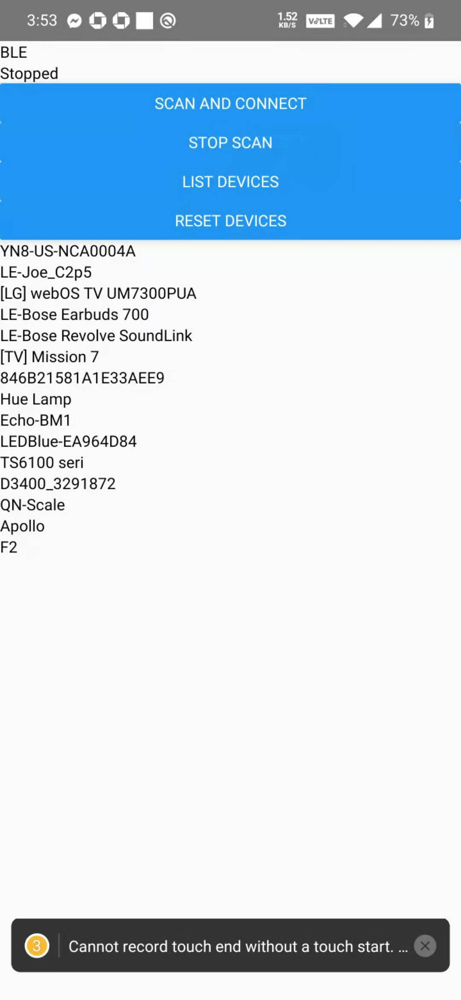

# Intro
This app will be based on https://github.com/Polidea/react-native-ble-plx.

# Features
 - Scan BLE devices
 - Read Service, Characteritics
 - Write characteristics

# How to install? 
 1. npm install
 2. (Android) react-native run-android or (iOS) react-native run-ios (not tested on iOS yet though)

# Settings change to make app work (Android)

https://github.com/awsk1994/Bluetooth-BLE-React-App/commit/2352ad01c676418b62d4ee249b4c72b48d6a1882#diff-f60ed56a9c8275894022fe5a7a1625c33bdb55b729bb4e38962af4d1613eda25

```js
// android/app/src/main/AndroidManifest.xml
<uses-permission android:name="android.permission.BLUETOOTH_ADMIN"/>
<uses-permission android:name="android.permission.BLUETOOTH"/>
<uses-permission-sdk-23 android:name="android.permission.ACCESS_COARSE_LOCATION"/>

<uses-feature android:name="android.hardware.bluetooth_le" android:required="true"/>
```

```js
// android/build.gradle
buildscript {
    ext {
        buildToolsVersion = "29.0.2"
        minSdkVersion = 18  // change this from 16 to 18
        compileSdkVersion = 29
        targetSdkVersion = 29
    }
````

```js
// android/settings.gradle
rootProject.name = 'VultantGlassesAlpha'
include ':react-native-ble-plx'   // Add this
project(':react-native-ble-plx').projectDir = new File(rootProject.projectDir, '../node_modules/react-native-ble-plx/android')  // Add this
apply from: file("../node_modules/@react-native-community/cli-platform-android/native_modules.gradle"); applyNativeModulesSettingsGradle(settings)
include ':app'
```

# Settings change to make app work (iOS) - Untested/Verified
```js
// ios/Podfile
  use_react_native!(:path => config["reactNativePath"])

  pod 'react-native-ble-plx', :path => '../node_modules/react-native-ble-plx' // Add this

  target 'VultantGlassesAlphaTests' do
    inherit! :complete
```

# Create aab
https://reactnative.dev/docs/signed-apk-android

```
keytool -genkeypair -v -keystore my-upload-key.keystore -alias my-key-alias -keyalg RSA -keysize 2048 -validity 10000
```
 - pw = vultant
 - for: CN=Alex Wong, OU=Vultant, O=Vultant, L=Hong Kong, ST=Hong Kong, C=HK

# aab to apk
1. Download bundletool (https://developer.android.com/studio/command-line/bundletool#download)
2. rename as bundletool.jar
3. copy to project dir.
4. Run following
```
java -jar bundletool.jar build-apks --bundle=./android/app/build/outputs/bundle/release/app-release.aab --output=./my_app.apks --ks=./android/app/my-upload-key.keystore --ks-key-alias=my-key-alias --mode=universal
```
5. rename my_app.apks to my_app.zip
6. unzip my_app.zip to find universal.apk


https://stackoverflow.com/questions/53040047/generate-apk-file-from-aab-file-android-app-bundle

# Log
 - 12/18/2020
   - Problem: "BleError: Cannot start scanning operation"
       - Solution: Restart(turn off -> turn on) bluetooth and Try again.



 - 12/18/2020 (2)
    - Problem: normal phone/laptop are all Ble-central, but ble-central can only connect to ble-peripheral. And I need a way to test it (and I don't have ble-peripheral devices).
      - Solution: use ble-peripheral simulator (https://github.com/himelbrand/react-native-ble-peripheral) 
      - To speed up progress, I found an example project that uses the ble-peripheral-simulator library. .We will be using https://github.com/hezhii/react-native-ble-demo/blob/master/ble_peripheral to run ble-peripheral on 1 android phone, and run this project on another android phone.
     - Problem: Unable to read characteristics -> characteristic is not readable -> should display it.
       - Solution: Some characteritiscs are not readable. I added characteristic details to show what is readable, writableWithResponse and writableWithoutResponse.


 - 12/19/2020 (3)
   - Problem: Although writing to characteristics seem to work, sometimes the read after write is not the correct(expected) value. Might be due to hex/bytes problem.
    - Solution: This is fixed.

 - 12/23/2020
     - Problem: I think peripherals can send message to centrals? Need to confirm.
     - TODO: Add a permanent/dismissable box for errors on top or bottom
     - TODO: fine-tune app with routes.etc